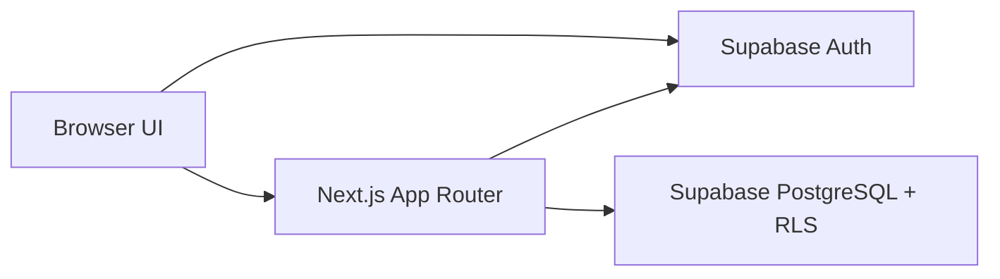

# Architecture

LifeOS는 브라우저, Next.js, Supabase 세 계층으로 구성된다.

## 인증 흐름

- 브라우저 클라이언트는 로그인, 회원가입, 비밀번호 재설정 요청을 처리한다.
- middleware는 Supabase SSR 클라이언트로 세션 쿠키를 갱신한다.
- 보호 라우트는 사용자 세션이 없으면 `/login`으로 보낸다.
- 로그인한 사용자가 인증 페이지에 접근하면 `/dashboard`로 이동한다.

## 책임 분리

- Client Components: 인증 폼, 로그아웃 버튼 같은 브라우저 상호작용.
- Server Components: 사용자별 데이터 조회와 화면 렌더링.
- Server Actions: 폼 입력 검증 후 단순 변경 또는 RPC 호출.
- PostgreSQL Functions: 원자성이 필요한 전환과 제한 검증.
- RLS: 최종 데이터 격리 계층.

## 데이터 변경 흐름

Inbox 빠른 등록은 Server Action에서 Zod 검증 후 `inbox_items`에 insert한다. Inbox를 Project로 전환할 때는 `convert_inbox_to_project` RPC가 inbox row를 lock하고 활성 프로젝트 한도를 확인한 뒤 project 생성과 inbox 상태 업데이트를 한 트랜잭션으로 수행한다.

Today 행동 추가는 `add_core_action_to_today` RPC가 daily plan을 생성/조회하고 핵심 행동 한도를 확인한 뒤 `daily_plan_actions`와 action 상태를 함께 갱신한다.
