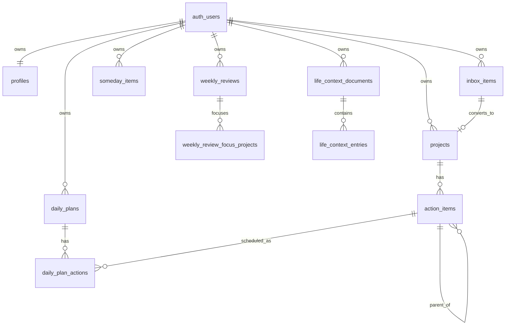

# Database

## ERD

## 테이블

- `profiles`: 시간대, 주 시작 요일, 프로젝트/핵심 행동 제한.
- `inbox_items`: 제목만으로 생성 가능한 생각 기록.
- `projects`: ACTIVE, WAITING, PAUSED, COMPLETED, ABANDONED, ARCHIVED 상태.
- `action_items`: 프로젝트에 속한 활동. `parent_action_id`로 같은 테이블의 부모 활동을 선택적으로 참조한다.
- `daily_plans`: 날짜별 에너지와 모드. `unique(user_id, plan_date)`.
- `daily_plan_actions`: 오늘 계획에 선택된 행동. `unique(daily_plan_id, action_item_id)`.
- `someday_items`: 나중에 볼 항목.
- `weekly_reviews`: 주간 회고.
- `weekly_review_focus_projects`: 회고에서 선택한 최대 3개 초점 프로젝트.
- `daily_check_ins`: 하루 한 번 상태 기록.
- `life_context_documents`: 사용자 장기 컨텍스트 원문. 예: Life-OS 사용자 시드 데이터 v1.
- `life_context_entries`: 장기 컨텍스트를 섹션별로 나눈 검색/참조 단위.

## 제약과 인덱스

모든 사용자 소유 테이블은 `user_id default auth.uid()`와 RLS 정책을 가진다. 조회 빈도가 높은 `(user_id, status)`, `(user_id, date)` 조합에 인덱스를 둔다. 활동 트리 조회에는 `(user_id, project_id, parent_action_id, created_at)` 인덱스를 사용한다.

활동 부모는 같은 사용자와 같은 프로젝트 안에서만 지정할 수 있다. `validate_action_hierarchy` 트리거가 자기 참조, 자신의 후손 아래로 이동하는 순환 관계, 다른 프로젝트 또는 사용자 소유 활동 연결을 막는다. 부모 활동 삭제 시 직계 하위 활동은 최상위 활동으로 이동한다.

## 상태 전환

앱 규칙은 `src/lib/domain/rules.ts`에 있으며, DB에서는 닫힌 프로젝트에 새 행동을 추가하지 못하도록 트리거가 막는다. 활성 프로젝트 한도와 핵심 행동 한도는 RPC에서 확인한다.

## Migration 관리

초기 스키마는 `supabase/migrations/202607150001_initial_schema.sql`에 있고 활동 계층 확장은 `supabase/migrations/202607160001_action_hierarchy.sql`에 있다.
